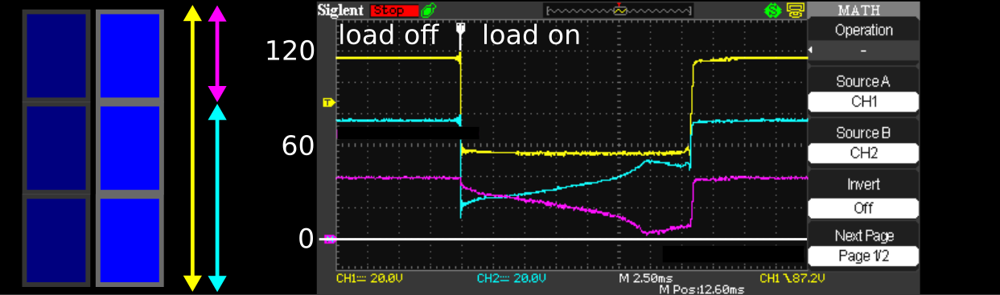

# direct-pv2heat-meter

## the (initial) idea

This project is about an experimental power2heat application. Photovoltaic shall be used to heat water with a resistive heating rod. Directly off-grid, without any inverter, MPPT tracker, or the like. Note that this is known to be a dumb solution in terms of efficiency (e.g. see [1] or [2]). My goal with this project is to collect data to see how bad my solution really is. And another goal is to keep it safe.

**DANGER!** This project deals with dangerous electric power. Do not reproduce except you really know what you are doing!

As there is no regulator involved to match the characteristic of the pv panels and the heater, special care was taken to dimensioning of the parts. At the start of the project I was about to buy a hot-water heat pump, which comes with a heating rod of 1.5kW@230V (equivalents 6,52A or 35,3 Ohm). This one is not required for the intended usage, so I will use it for the project to avoid any extra plumber work. My local photovoltaic dealer offered 375W modules (datasheet names Vmpp=34,6/32,3V and Impp=10,8/8,7A which equivalents Rmpp=3,2/3,7Ohm per module).

[3] proposes a "PV magic water heater formula: Element ohms equal (Vmp/Imp) x 1.40", which translates to a recommondation of 6.8 pv modules in my case. I chose 6. 6 es even, so I can build 2 strings of 3 modules for an alternate usage. Kirchhoff allows us to double the current by simply putting 2 strings in parallel, and power goes with current squared, so I did not want to waste that option too early.

Dividing into 2 strings resulted in another advantage. The maximum input voltage reduced to 3 *41,1V *1,1=135V. This lead me to the idea of using a TL783 as a first stage of my logic power supply, as it allows 125V in-out voltage difference. Unforfunately it was not availabe at the time of ordering and I did not find a 1:1 replacement. I still wanted to power the logic by the pv itself and ensure galvanic isolation, so i designed in an extra intermediate tap in one string. So the maximum input voltage the logic has to deal with is 41,1V *1,1=45V. This is low enough to find an (available) linear regulator for 24V (for relais supply) and a DC DC converter with 3.3V output (for the logic). Furthermore this allows for direct connection to the current metering IC's breakout board SparkX Power Meter - ACS37800 (Qwiic) [4] (<60V). (note the drawbacks below before you also consider this approach)

See image for the resulting overall wiring. 

I said I want to keep the usage safe. Power to the heater shall be interruptable. A certain temperature shall not be exceeded. The interruption is realized with FETs. Big ones with screw terminals, not PCB mounted. As a temperature sensor I want to use the built-on from the hot-water heat pump. The control is not realized yet, but for the pv hardware I realized it as following: A on-command/trigger-signal has to be received every few seconds. If not, the power output will shut down. That should be safe enough for me.

The logic is realized on an ESP32, as it is well-affordable and offers BLE (read: established way of low-power galvanically isolated communication). As counterpart I built a BLE-Wifi-Bridge, also based on an ESP32 (I chose a Firebeetle, so no soldering on this part). That is enough that all the rest (logging, controlling) can be realized in software.

System overview (like initially planned):

   

## (further) development

This chapter is about selected aspects of the (ongoing) development.

### Delivery Issues

Unforfunately the hot water heat pump was not delivered in time (and still isn't at the time of writing. a typical 2022 issue). So I changed the scope of heating: from water to air. Thus I avoid the delivery issue as I have a few dumb (=resisitve) 230V heaters lying around. As they have different wattages a new idea came across: Can I use different permutations to optimize efficiency? Later. First, I have to solve a different problem:

### Logic Supply Issues. Or 3 $\neq$ 1+2. Or: About pv panel mismatch.

The circuit generally works. But under certain conditions I could not turn on the load without the microcontroller going in reset, which turns the load off again by design. It turns out that the logic's supply voltage :purple_square: drops. Why? 

When connecting a load under low light conditions, the string voltage :yellow_square: drops, in this case from ~120 to ~60V. Then it remains stable. That is expected and should *not* cause any issues.

But I made a wrong assumption. I assumed that every panel contributes the same voltage to the string, like batteries. This is what I tried to exploit to ease my logic supply. But as I could see on the scope, the panel's voltages can diverge a lot! Almost down to zero for the panel that is supposed to support the microcontroller.

The source of this effect is mismatch. See [5] for a good introduction to the topic. In addition to inherent panel variation, we draw an extra current from one panel (to supply the logic). This current is only ~30mA (@20V). This sounds negligable in contrast to the load current (in general >1A). But it is not. Why?

Because a pv panel is not (always) a voltage source. It is known to be more like a current source. Well in my opinion it is both, but it depends on the operating point. And for operation points "far left of the MPP" a current source is definitely the better model. See plot.

Let's zoom in to our "current source", plot it for 3 panels, assuming a little variation. As Kirchoff forces the current to be the same for all 3, voltage has to vary *a lot*. 

In the end this effect makes the initially proposed circuit fail in "current source mode", or said otherwise: it only works for high irradiation. 

A possible solution: Characterize the panels, hope that one is significantly better than all others, and hand-select the "best" one for the logic supply. Or make all others worse artifically, by a small extra load. Both approaches do not seem reasonable to me.

A more realistic solution: Generate the required votages from the whole string (3 panels instead of just 1). Unfortunately it is not soo easy to find (linear) regulators or (dc/dc) converters for that (wide) input range. Furthermore we need to consider the similar effect when switching from parallel (2x3 panels) to serial (1x6 panels) configuration. To be continued. 

[1] https://www.solarpaneltalk.com/forum/solar/solar-energy-facts/325254-solar-panel-directly-connected-to-immersion-heater  
[2] https://diysolarforum.com/threads/direct-solar-pv-water-heater.27937/  
[3] http://waterheatertimer.org/Solar-power-curves-for-water-heater.html  
[4] https://www.sparkfun.com/products/17873  
[5] https://www.pveducation.org/pvcdrom/modules-and-arrays/mismatch-for-cells-connected-in-series and https://www.pveducation.org/node/168/talk  
