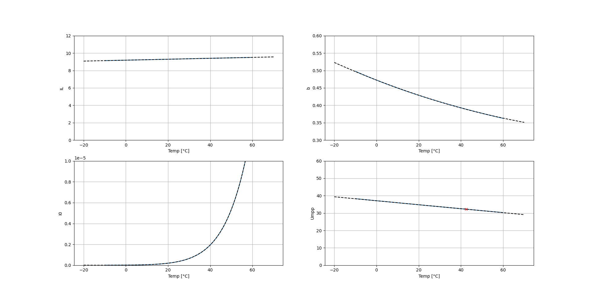
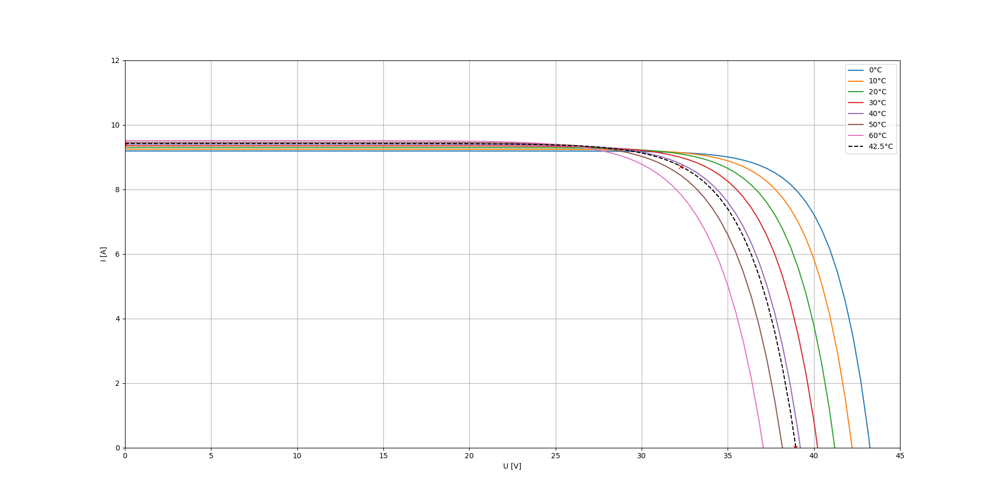
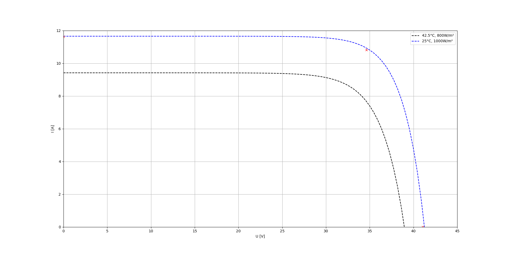
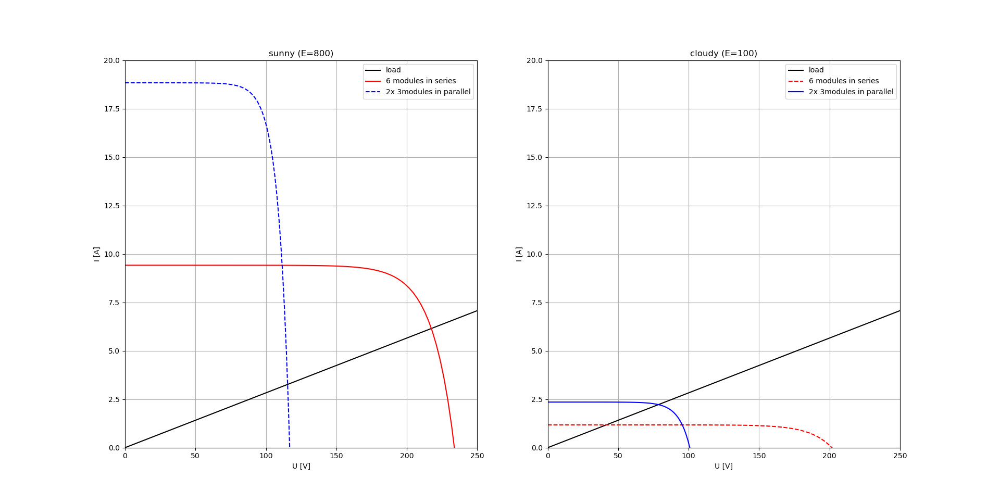
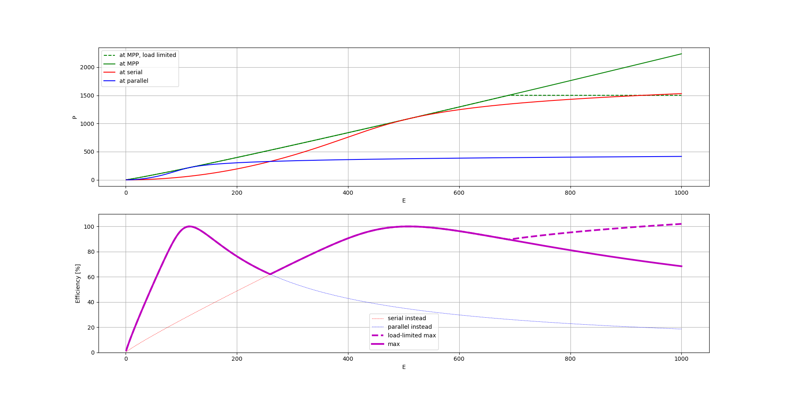

For this project I needed a (temperaturedependent) description of the IV-curve of my photovoltaic module. So I developed one, based on the datasheet and a litte math.

The model is as simple as:
$$I(U) = I_L - I_0 \cdot \exp(b\cdot U)$$

3 unknown coefficients tell us that 3 equations might be useful to determine them. Luckily the datasheet tells us 3 different working points, so we can request:
$$ I_{SC}=I_L-I_0\cdot 1 $$
$$ 0=I_L-I_0\cdot \exp(b\cdot U_{OC}) $$
$$ I_{mpp}=I_L-I_0\cdot \exp(b\cdot U_{mpp}) $$
where $I_{SC}$ is the short-circuit current, $U_{OC}$ is the open circuit voltage, $I_{mpp}$ and $U_{mpp}$ are maximum power point values. 

Unfortunately, temperature coefficients are only given for $I_{SC}$, $U_{OC}$, and $P_{mpp}(=I_{mpp}\cdot U_{mpp})$ (grr... the product, not the factors...). Ok, let's replace $I_{mpp}=P_{mpp}/U_{mpp}$:

$$  \frac{P_{mpp}}{U_{mpp}}=I_L-I_0\cdot \exp(b\cdot U_{mpp}) $$

As $U_{mpp}$ is not given, there are now 4 unknowns, so a 4th condition might be useful. Luckily there is one. We know that the power P has a maximum at the MPP, so we can state a derivation of zero:

$$\frac{d}{dU}P(U_{mpp}) \stackrel{!}{=} 0 $$

$$\frac{d}{dU}P = \frac{d}{dU}(U\cdot I(U)) = 
\frac{d}{dU}U\cdot I(U) + U\cdot \frac{d}{dU}(I(U)) =
1\cdot I(U) + U\cdot \frac{d}{dU}I(U)  $$

intermediate calcualtion:

$$\frac{d}{dU}I(U) = \frac{d}{dU}I_L - \frac{d}{dU}I_0 \cdot \exp(b\cdot U) - I_0 \cdot \exp(b\cdot U) \cdot b$$

inserted in the above:
$$\frac{d}{dU}P = 1 \cdot I(U) + U\cdot (\frac{d}{dU}I_L - \frac{d}{dU}I_0 \cdot \exp(b\cdot U) - I_0 \cdot \exp(b\cdot U) \cdot b)$$

$$\frac{d}{dU}P = \frac{P}{U} + U\cdot \frac{d}{dU}I_L + U \cdot \exp(b\cdot U) \cdot ( -\frac{d}{dU}I_0  - I_0  \cdot b)$$

$$0 \stackrel{!}{=}  \frac{P_{mpp}}{U_{mpp}} + U_{mpp}\cdot dI_L + U_{mpp} \cdot \exp(b\cdot U_{mpp}) \cdot ( -dI_0  - I_0  \cdot b)$$

Looks like we won more variables, $dI_L$ and $dI_0$, but we can assume voltage-independency, $\approx0$:
$$0 \stackrel{!}{=}  \frac{P_{mpp}}{U_{mpp}} - U_{mpp} \cdot \exp(b\cdot U_{mpp}) \cdot  I_0  \cdot b$$

With this as the 4th condition, we can fit the parameters, including their temperature-dependency. 

Given the parameters, we can draw curves for every temperature we like.

What is still missing is the irradiation dependency. Here we simply assume $I_L$ to be directly proportional to the irradition power $E$, which leads to the final model, $T$ is temperature in °C:

$$I_{L,800}(T) = 0.00536952652515192\cdot T + 9.191799383372592 $$
 $$ I_0(T) = 1.87942600e^{-20}\cdot T^8
-4.86961403e^{-19}\cdot T^7
+1.17433360e^{-16}\cdot T^6 \\
+2.68834696e^{-15}\cdot T^5 
+1.81678067e^{-13}\cdot T^4
+5.95891947e^{-12}\cdot T^3 \\
+1.31406079e^{-10}\cdot T^2
+1.85584490e^{-09}\cdot T
+1.21572220e^{-08}
$$
$$ b(T)  = 8.84231653091366e^{-06}\cdot T^2 -0.002355382115251495\cdot T + 0.4725462916388404$$
$$ I(T,E,U)  = \frac{E}{800}\cdot I_{L,800}(T) - I_0(T)\cdot \exp(b(T)\cdot U)$$

Let's countercheck that with the second datapoint given from the datasheet, $E[W/m²]=1000$ at $25\text{°C}$.

I am happy with that. I think the error should be negligable in relation to the impact of several other effects which are not modelled here at all.

Note that in general we don't know temperature nor irradiation. In my case I spent a temperature sensor right under one of the modules. I am aware that this will not deliver the silicon temperature, but it should be a good estimate. As I also can measure $I$ und $U$, I should be able to estimate $E$. To be checked.

Knowing the IV curve allows me to estimate the power at a different working point (series vs. parallel wiring), to see if it is worth switching. Quite a lot of calculation to be done for deciding between only two options ;)

Here is an illustration of what I mean. We can choose between the crossing of the black line with the either red or blue. Which one is better (in terms of: delivers more power) depends on the situation (mainly the light).

Some words on efficiency. When I started with this project I often found threads claiming that such a solution is bad in terms of efficiency. Let's do own estimates based on what we have learned so far (here for 30°C):

This theory sais we can achieve more than 60% efficiency for a wide range of irradition, often much better. I don't think this is too bad, if you consider the simplicity of the circuitry. 
